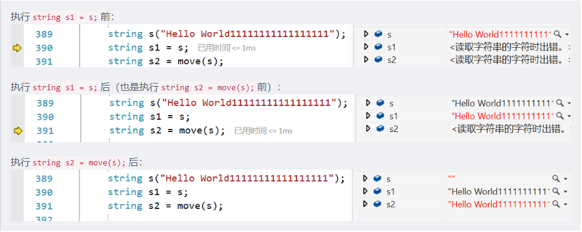
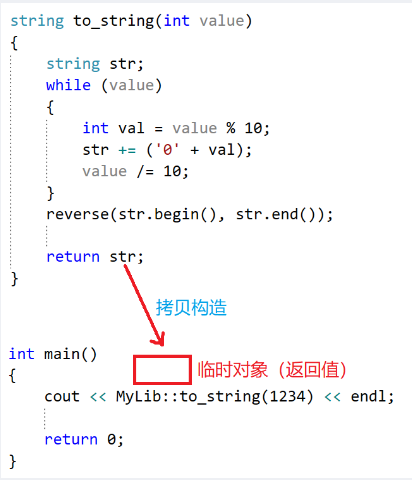
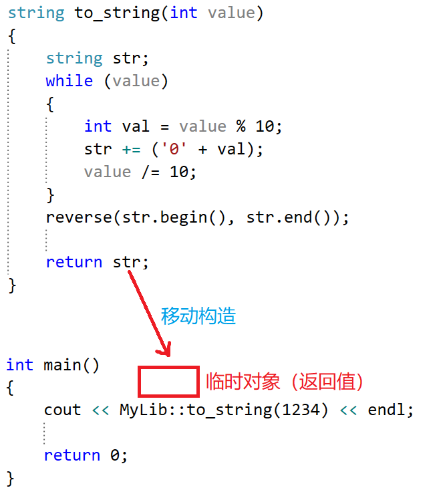
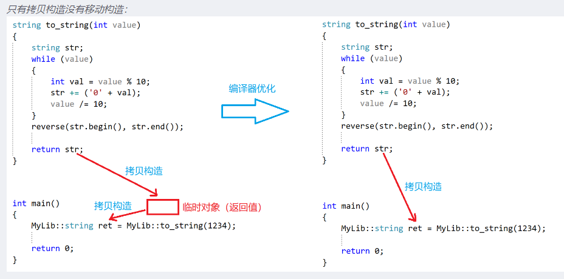
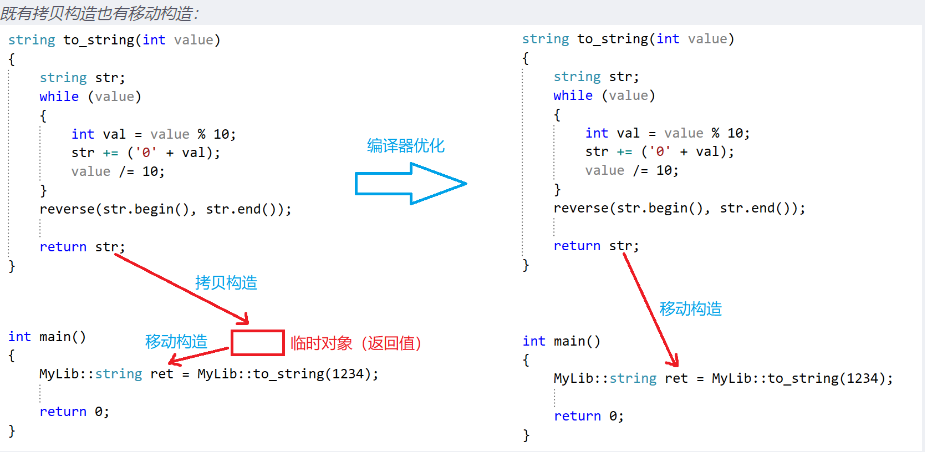

## 左值和右值

### 左值 [可以取地址的对象就是左值]

左值是一个表示数据的表达式，比如：变量名、解引用的指针变量。一般地，我们**可以获取它的地址和对它赋值**，但被 const 修饰后的左值，不能给它赋值，但是仍然可以取它的地址。

### 右值[不可以取地址的对象就是右值]

右值也是一个表示数据的表达式，比如：字面常量、表达式返回值，传值返回函数的返回值（是传值返回，而非传引用返回），右值不能出现在赋值符号的左边且不能取地址。

区分左值和右值，终究还是要看能否取地址。

## 左值引用和右值引用

传统的 C++ 语法中就存在引用语法，而 C++11标准中新增了右值引用的语法特性，因此为了区分两者，将C++11标准出现之前的引用称为左值引用。无论左值引用还是右值引用，都是给对象取别名。

#### 左值引用【避免对象拷贝】

左值引用就是对左值的引用，给左值取别名。**主要作用是避免对象拷贝。**

```c++
int a = 10;
int* p = &a;
int b = 20;

// 以下几个是对上面左值的左值引用
int& ra = a;
int*& rp = p;
int& r = *p;
const int& rb = b;
```

#### 右值引用【延长对象生命周期】

右值引用就是对右值的引用，给右值取别名。**主要作用是把延长对象的生命周期，一般是延长到作用域的scope之外**。

右值引用的表示是在具体的变量类型名称后加两个&，比如：int&& a = 4;。

```c++
int add(int x, int y)
{
    return x + y;
}

int x = 20;
int y = 30;

// 以下几个是右值引用
int&& rr1 = 10;
double&& rr2 = x + y;
double&& rr3 = add(x, y);
```

现在我们知道左值引用可以引用左值，右值引用可以引用右值。
那么左值引用是否可以引用右值？右值引用是否可以引用左值呢？

- 左值引用可以指向右值，但需要const来修饰，不能修改这个值
- 右值引用可以指向左值，需要std::move(v)即可, std::move(v)就是将左值 v 转移成右值
- 声明出来的左值引用或右值引用都是左值

### 对比与总结

#### 左值引用总结

左值引用只能引用左值，不能直接引用右值。但是**const左值引用既可以引用左值，也可以引用右值**。

```c++
int add(int x, int y)
{
    return x + y;
}

int main(int argc, char const *argv[])
{
    // 1.左值引用只能引用左值
    int t = 8;
    int& rt1 = t;
    //int& rt2 = 8; // 编译报错，因为8是右值，左值引用不能直接引用右值

    // 2.但是const左值引用既可以引用左值
    const int& rt3 = t;
    const int& rt4 = 8; // 也可以引用右值 const int& rt4本质上也是一个常量，指向一个不能被修改的右值，也是安全的

    int x = 20;
    int y = 30;   
    const double& r1 = x + y;
    const double& r2 = add(x, y);
    return 0;
}
```

#### 右值引用总结

右值引用只能引用右值，不能直接引用左值。但是**右值引用可以引用被move的左值**。move，本文指std::move（C++11），作用是将一个左值强制转化为右值，以实现移动语义。左值被 move 后变为右值，于是右值引用可以引用。

### 左值引用的使用场景及实际意义

#### 左值引用场景【主要是避免对象拷贝】

##### 左值引用做参数

当引用作为参数的时候，其效果跟利用指针作为参数的效果相当。当调用函数时，函数中的形参就会被当成实参变量或者对象的一个别名使用，也就是说**函数中对形参的各种操作实际上就是对实参本身的操作**，而非简单的实参变量或者对象的值拷贝给形参。

#### 左值引用做返回值（仅限于对象出了函数作用域以后还存在的情况）

#### 实际意义（减少拷贝，节省内存，提高效率）

值传参和值返回都会产生拷贝，有的甚至是深拷贝，代价很大。而左值引用的实际意义在于做参数和做返回值都可以减少拷贝。

#### 短板【不能引用局部变量问题】

左值引用虽然较完美地解决了大部分问题，但对于有些问题仍然不能很好地解决。

**全局变量**: 当对象（全局变量）出了函数作用域以后仍然存在时，可以使用左值引用返回，这是没问题的。

**局部变量**: 但当对象（对象是函数内的局部对象）出了函数作用域以后不存在时，就不可以使用左值引用返回了。

#### 右值引用

为了解决上述传值返回的拷贝问题，C++11标准就增加了**右值引用** 和 **移动语义**。

#### 移动语义

将一个对象中的资源移动到另一个对象（资源控制权的转移）。

##### 移动构造

拷贝构造函数和移动构造函数都是构造函数的重载函数，所不同的是：

- 拷贝构造函数的参数是 **const左值引用，接收左值或右值**；
- 移动构造函数的参数是 **右值引用，接收右值或被 move 的左值**。

注：当传来的参数是右值时，虽然拷贝构造函数可以接收，但是编译器会认为移动构造函数更加匹配，就会调用移动构造函数。

总的来说，如果这两个函数都有在类内定义的话，在构造对象时：

- 若是左值做参数，那么就会调用拷贝构造函数，做一次**拷贝**。
- 若是右值做参数，那么就会调用移动构造，而调用移动构造就会**减少拷贝**。

比如执行下面这几行代码：

```c++
string s("Hello World11111111111111111");
string s1 = s; // s是左值，所以调用拷贝构造函数
string s2 = move(s); // s被move后变为右值，所以调用移动构造函数，s的资源会被转移用来构造s2
// 要注意的是，move一般是不这样用的，因为s的资源被转走了
```



#### 移动构造有无的比较

- **只有拷贝构造没有移动构造**



-->>>  **在 to_string 函数栈帧销毁前，用局部对象 str 拷贝构造出临时对象返回到函数调用处【此时str也被成为将亡值，返回的是右值】**

- **既有拷贝构造也有移动构造**



**--->>>：** **在 to_string 函数栈帧销毁前，用局部对象 str （反正 str 要销毁，将 str 视为右值，直接转移 str 的资源 ）移动构造出临时对象返回到函数调用处**。

- **只有拷贝构造没有移动构造 编译器优化：**



**-->>>: 在 to_string 函数栈帧销毁前，先用局部对象 str 拷贝构造出临时对象返回到函数调用处，to_string 函数栈帧销毁后，再用临时对象拷贝构造出 ret 。**

**但现在的编译器一般都会进行优化：因为临时对象有 ret 来接收，这样的话临时对象的创建和销毁就显得多余了，不如省略掉这一步，直接用 str 拷贝构造出 ret 。**

- **既有拷贝构造也有移动构造 编译器优化：**



**-->>>:在 to_string 函数栈帧销毁前，由于局部对象 str 是左值（可以对它取地址），所以用 str 拷贝构造出临时对象返回到函数调用处，to_string 函数栈帧销毁后，由于临时对象是右值，所以用临时对象移动构造出 ret 。**

**但现在的编译器一般都会进行优化：因为临时对象有 ret 来接收，先拷贝构造出临时对象再用它移动构造出 ret ，临时对象好像没必要产生一样，不如省略掉。既然 str 是 to_string 函数栈帧的局部对象，最后还是要销毁，不如将 str 视为右值，直接转移 str 的资源用来构造 ret ，也就是直接用 str 移动构造出 ret 。**