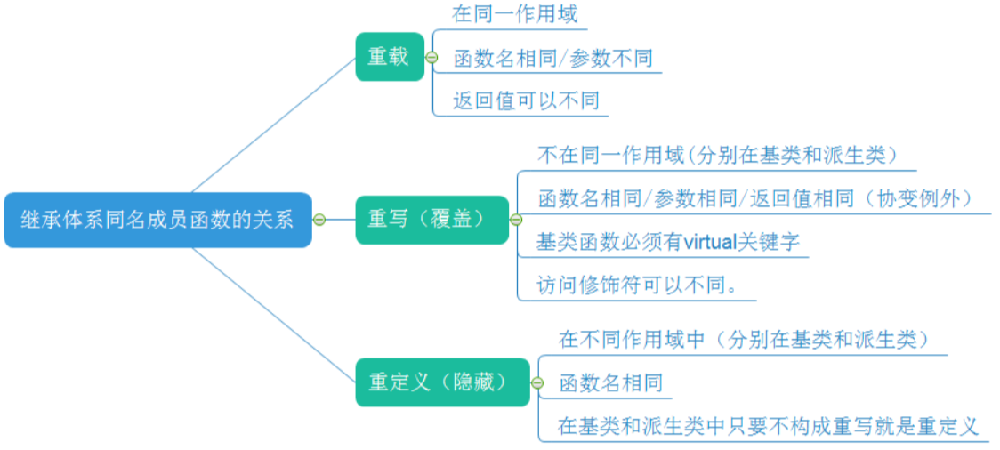

# 你需要知道

## **重载 vs 重写 vs 重定义：**

### **重载**

一般是在一个类实现若干重载的方法，是允许有多个同名的函数，而这些函数的参数列表不同即允许参数个数不同或参数类型不同，或者两者都不同，但是不能靠返回类型来判断。。编译器会根据这些函数的不同列表，将同名的函数名称做修饰，从而生成一些不同名称的预处理函数，来实现同名函数调用时的重载问题。

### **重写**

则只针对虚函数。一般用于子类在继承父类时，重写父类中的方法。函数特征相同，但是具体实现不同。被重写的函数不能是static的，必须是virtual的。重写函数必须有相同的返回值类型，相同的函数名称和相同的参数列表。重写函数的访问修饰符可以不同。尽管virtual是private的，派生类中重写改写为public、protect也是可以的。虚函数重写的两种特殊情况: *协变* ( 派生类重写基类虚函数时 ，与基类虚函数 返回值类型不同 ), *析构函数的重写* ( 基类与派生类析构函数的名字不同 ), 如果基类的析构函数为虚函数，此时派生类析构函数只要定义，无论派生类析构函数是否加virtual关键字，都与基类的析构函数构成重写，虽然基类与派生类析构函数名字不同，看起来违背了重写的规则，其实不然，这里可以理解为编译器对析构函数的名称做了特殊处理，编译后析构函数的名称统一处理成 destructor 。

The **override specifier** (keyword) is used to redefine the base class function in a derived class with the same signature i.e. return type and parameters. In other words, it specifies that a method overrides a virtual method declared in one of its parent classes. Regarding virtual overrides, C++11 tends to tighten the rules, to detect some problems that often arise.

To achieve this goal C++11 introduces two new contextual keywords:

- **final** specifies that a method cannot be overridden, or a class cannot be derived.
- **override** specifies that a method overrides a virtual method declared in one of its parent classes.

The override specifier generally has two purposes,

- It shows that a given virtual method is overriding a virtual method of the base class.
- It indicates to the compiler that you are not adding or altering new methods that you think are overrides, and the compiler knows that is an override.

```c++
#include <iostream>
 
class Tbase
{
 virtual void a();
 void b();
 virtual void c() final;
 virtual void d();
};
 
class Tx : Tbase
{
 void a() override; // correct
 // void b() override; // error, an override can only be used for virtual functions
 // void c() override; // error, cannot override a function marked as final
 // int d() override; // error, different return type
};
 
int main()
{
    class Tx o1;
}
```

### **重定义**

就是派生类对基类的成员函数重新定义，即派生类定义了某个函数，该函数的名字与基类中函数名字一样。子类重定义父类中有相同名称的非虚函数（返回值类型可以不同, 参数列表可以不同）。如果一个子类存在和父类相同的函数，那么这个类将会覆盖其父类的方法，除非你在调用的时候，强制转换为父类类型。重定义需要注意：不在同一个作用域（分别位于基类、派生类）, 函数的名字必须相同, 对函数的返回值、形参列表无要求,对函数的访问权限无要求. 若派生类定义该函数与基类的成员函数完全一样(返回值、函数名、形参列表均相同,访问修饰符可以不同)，且基类的该函数为virtual，则属于派生类重写基类的虚函数。若重新定义了基类中的一个重载函数，则在派生类中，基类中该名字函数（即其他所有重载版本）都会被自动隐藏，包括同名的虚函数。



## 思考题

### **为什么调用普通函数比调用虚函数的效率高？**

因为普通函数是静态联编的，而调用虚函数是动态联编的。联编的作用：程序调用函数，编译器决定使用哪个可执行代码块。

- 静态联编 ：在编译的时候就确定了函数的地址，然后call就调用了。
- 动态联编 ：首先需要取到对象的首地址，然后再解引用取到虚函数表的首地址后，再加上偏移量才能找到要调的虚函数，然后调用。

明显动态联编要比静态联编做的操作多，肯定就费时间。

### **为什么要用虚函数表（存函数指针的数组）？**

- 实现多态，父类对象的指针指向父类对象调用的是父类的虚函数，父类对象的指针指向子类对象调用的是子类的虚函数。
- 同一个类的多个对象的虚函数表是同一个，一个类自己的虚函数和继承的虚函数还有重写父类的虚函数都会存在自己的虚函数表。

### **为什么要把基类的析构函数定义为虚函数？**

在用基类操作派生类时，为了防止执行基类的析构函数，不执行派生类的析构函数。因为这样的删除只能够删除基类对象, 而不能删除子类对象, 形成了删除一半形象, 会造成内存泄漏。如下代码:

```c++
#include<iostream>  
using namespace std;  
  
class Base  
{  
public:  
    Base() {};  
    ~Base()   
    {  
        cout << "delete Base" << endl;  
    };  
};  
  
class Derived : public Base  
{  
public:  
    Derived() {};  
    ~Derived()  
    {  
        cout << "delete Derived" << endl;  
  
    };  
};  
int main()  
{  
    //操作1  
    Base* p1 = new Derived;  
    delete p1;  // delete Base
    //因为这里子类的析构函数重写了父类的析构函数，虽然子类和父类的析构函数名不一样，  
    //但是编译器对析构函数做了特殊的处理，在内部子类和父类的析构函数名是一样的。  
    //所以如果不把父类的析构函数定义成虚函数，就不构成多态，由于父类的析构函数隐藏了子类  
    //的析构函数，所以只能调到父类的析构函数。  
    //但是若把父类的析构函数定义成虚函数，那么调用时就会直接调用子类的析构函数，  
    //由于子类析构先要去析构父类，再析构子类，这样就把子类和继承的父类都析构了  
}  
```

