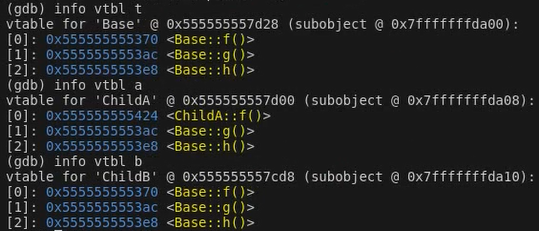
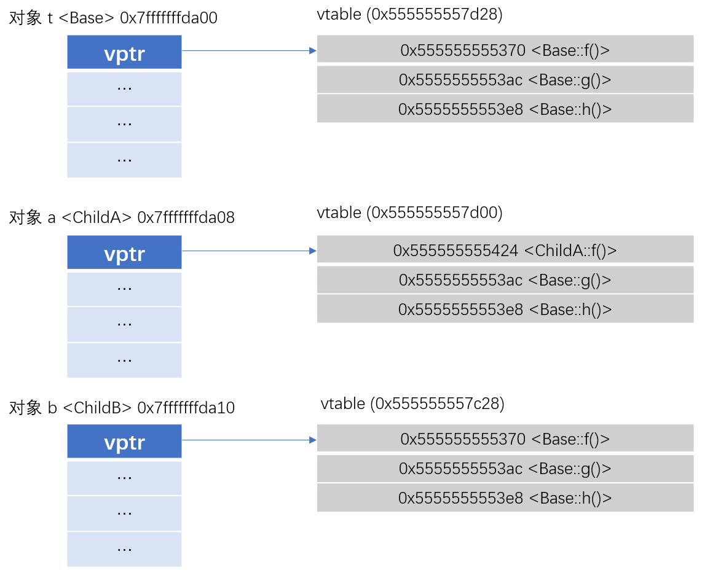
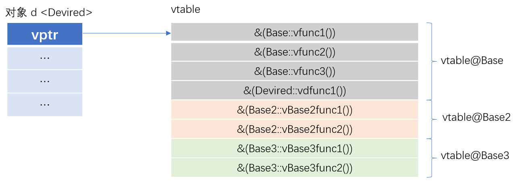

# 第2章 多态的实现原理

多态按字面的意思就是多种形态，相同的方法调用，但是有不同的实现方式。多态性可以简单地概括为“一个接口，多种方法”。
C++有两种多态形式：

- 静态多态, 就是重载, 因为在编译期确定，所以称为静态多态。在编译时就可以确定函数地址。
- 动态多态, 就是通过继承重写基类的虚函数实现的多态，在运行时确定。运行时在虚函数表中寻找调用函数的地址。

## 1. 静态多态

静态多态：也称为编译期间的多态，编译器在编译期间完成的，编译器根据函数实参的类型(可能会进行隐式类型转换)，可推断出要调用那个函数，如果有对应的函数就调用该函数，否则出现编译错误。静态多态有两种实现方式：函数重载与函数模板。

**函数重载**的关键是函数参数列表。包括：函数的参数数目和类型，以及参数的排列顺序。所以，重载函数与返回值，参数名无关。

**函数模板**是通用的函数描述, 用泛型定义函数, 其中泛型可用具体类型替换。将类型作为参数传递给模板，使编译器生成该类型的函数。

### 1.1 函数重载

```c++
class AA{

    public:
    	// _ZN2AA3sumEii
        int sum(int a , int b){
            return a+b;
        }
        
        // _ZN2AA3sumEdd
        double sum(double a, double b){
            return a+b;
        }

};

int main(int argc, char const *argv[])
{
    AA a;
    a.sum(1,2);
    a.sum(3.0,4.0);
    return 0;
}
```

```bin
g++ test1.cpp -o test1.o
objdump -t test1.o
```

结论：通过 objdump 分析，得知重载函数的描述符的规律如下：_ZN+类长度+类名+函数名长度+函数名+E+类型首字母

### 1.2 函数模板

```c++
#include <iostream>

class AA{

    public:
        template <typename T> 
        T sum(T a, T b,T c){
            return a+b+c;
        }

        template <typename T, typename Y, typename X> 
        T minus(T a, Y b, X c){
            return a-b-c;
        }

};

int main(int argc, char const *argv[])
{
    AA a;
    // _ZN2AA3sumIiEET_S1_S1_S1_
    std::cout<<a.sum<int>(1,2,3)<<std::endl;
    // _ZN2AA3sumIdEET_S1_S1_S1
    std::cout<<a.sum<double>(3.0,4.0,5.0)<<std::endl;

    // _ZN2AA5minusIdifEET_S1_T0_T1
    std::cout<<a.minus<double,int,float>(10.0,2,3.0f)<<std::endl;
    // _ZN2AA5minusIidiEET_S1_T0_T1
    std::cout<<a.minus<int, double, int>(20,2.0,4)<<std::endl;

    return 0;
}

// 1. 编译
// g++ 01_test.cpp -o test01

// 2. objdump
// objdump -t test01
```

结论：通过objdump分析，得知模板函数的描述符的规律如下: _ZN+类长度+类名+函数名长度+函数名+I+模板类型首字母+EET+占位符。

## 2. 动态多态

动态多态：即运行时的多态，在程序执行期间(非编译期)判断所引用对象的实际类型，根据其实际类型调用相应的方法。

- 通过基类类型的引用或者指针调用虚函数

- 必须是虚函数（派生类一定要重写基类中的虚函数）

若对象类型是子类, 就调用子类的函数；若对象类型是父类，就调用父类的函数(即指向父类调父类，指向子类调子类)此为多态的表现。

C++中的虚函数的作用主要是实现了多态的机制。关于多态，简而言之就是**用父类的指针指向其子类的实例**，然后**通过父类的指针调用实际子类的成员函数**。

这种技术可以让父类的指针有“多种形态”，这是一种泛型技术。所谓泛型技术，说白了就是试图使用不变的代码来实现可变的算法。比如：模板技术，RTTI技术，虚函数技术，要么是试图做到在编译时决议，要么试图做到运行时决议。

### 2.1 单继承下的虚表和虚表指针

虚表是指在每个包含虚函数的类中都存在着一个包含虚函数地址的数组。当类中声明虚函数时，编译器会在类中生成一个虚表，虚表是一个存储类成员虚函数指针的数据结构，虚表是由编译器自动生成与维护的，virtual成员函数会被编译器放入虚表中。当存在虚函数时，每个对象中都有一个指向虚表的指针(vptr指针)。C++的编译器保证vptr指针存在于对象实例中最前面的位置，这样通过对象实例的地址得到这张虚表，然后就可以遍历其中虚函数指针，并调用相应的虚函数。按照上面的说法，来看一个实际的例子：

```c++
#include <iostream>
#include <string>

using namespace std;

class Base {
	public:
		virtual void f() { cout << "Base:f()" << endl; }
		virtual void g() { cout << "Base:g()" << endl; }
		virtual void h() { cout << "Base:h()" << endl; }
};

class ChildA : public Base{
	public:
		void f() { cout << "ChildA:f()" << endl; }
};

class ChildB : public Base{
	public:
		void sayHi() { cout << "ChildB:sayHi()" << endl; }
};

int main()
{
	Base t;
	ChildA a;
	ChildB b;
	
	int breakpoint = 0;

    std::cout <<"第1个虚函数地址"<<(int*)(*((int*)&t))+0 << std::endl;
    std::cout <<"第2个虚函数地址"<<(int*)(*((int*)&t))+1 << std::endl;
    std::cout <<"第3个虚函数地址"<<(int*)(*((int*)&t))+2 << std::endl;
	return 0;
}
```

main定义Base类对象b，把&b转成`int*`，取得虚函数表的地址vtptr就是：`(int*)(&b)`，然后再解引用并强转成`int*`得到第一个虚函数的地址，也就是Base::f()即`(int*)(*((int*)&b))+0`，那么，第二个虚函数g()的地址就是`(int*)(*((int*)&t)) + 1`，依次类推。

<video width="700" height="600" controls>     <source src="https://pengfeinie.github.io/images/video/thinking_in_cpp/info_vtbl.mp4" type="video/mp4"> </video>

编译器为每个对象提供一个虚表指针vptr，这个指针指向`对象所属类`的虚表。在程序运行时，根据对象的类型去初始化vptr，从而让vptr正确的指向所属类的虚表，从而在调用虚函数时，就能够找到正确的函数。



从代码可以看到，第一个@后的内容是虚表的起始地址, 第二个@后的地址是对象的起始地址。



由于每个对象调用的虚函数都是通过虚表指针来索引的，也就决定了虚表指针的正确初始化是非常重要的。换句话说，在虚表指针没有正确初始化之前，我们不能够去调用虚函数。

- 若基类有虚函数，所有继承了该基类的子类都有虚表。
- 若子类没有重写虚函数，子类虚表中仍然会有所有基类虚函数的地址，这些地址指向的是基类的虚函数实现。
- 若子类重写了相应的虚函数，那么虚表中的地址就会改变，指向自身的虚函数实现，若子类有自己的虚函数，那么虚表中会加该项。
- 子类的虚表中虚函数地址的排列顺序和基类的虚表中虚函数地址排列顺序相同。
- 虚函数按照其声明顺序放于表中。父类的虚函数在子类的虚函数前面。

### 2.2 多继承下的虚表和虚表指针

如果是多重继承的话，问题就变得稍微复杂，主要有几点：

- 每个基类都有自己的虚函数表

- 派生类的虚函数地址依照声明顺序放在第一个基类的虚表最后（这点和单继承无虚函数覆盖相同)

  ```c++
  #include <iostream>
  class Base
  {
  public:
  	Base(int mem1 = 1, int mem2 = 2) : m_iMem1(mem1), m_iMem2(mem2) { ; }
  
  	virtual void vfunc1() { std::cout << "In vfunc1()" << std::endl; }
  	virtual void vfunc2() { std::cout << "In vfunc2()" << std::endl; }
  	virtual void vfunc3() { std::cout << "In vfunc3()" << std::endl; }
  
  private:
  	int m_iMem1;
  	int m_iMem2;
  };
  
  class Base2
  {
  public:
  	Base2(int mem = 3) : m_iBase2Mem(mem) { ; }
  	virtual void vBase2func1() { std::cout << "In Base2 vfunc1()" << std::endl; }
  	virtual void vBase2func2() { std::cout << "In Base2 vfunc2()" << std::endl; }
  
  private:
  	int m_iBase2Mem;
  };
  
  class Base3
  {
  public:
  	Base3(int mem = 4) : m_iBase3Mem(mem) { ; }
  	virtual void vBase3func1() { std::cout << "In Base3 vfunc1()" << std::endl; }
  	virtual void vBase3func2() { std::cout << "In Base3 vfunc2()" << std::endl; }
  
  private:
  	int m_iBase3Mem;
  };
  
  class Devired : public Base, public Base2, public Base3
  {
  public:
  	Devired(int mem = 7) : m_iMem1(mem) { ; }
  	virtual void vdfunc1() { std::cout << "In Devired vdfunc1()" << std::endl; }
  
  private:
  	int m_iMem1;
  };
  
  int main()
  {
  	// Test_3
  	Devired d;
  	int *dAddress = (int*)&d;
  
  	/* 1. 获取对象的内存布局信息 */
  	// 虚表地址一
  	int *vtptr1 = (int*)*(dAddress + 0);
  	int basemem1 = (int)*(dAddress + 1);
  	int basemem2 = (int)*(dAddress + 2);
  
  	int *vtpttr2 = (int*)*(dAddress + 3);
  	int base2mem = (int)*(dAddress + 4);
  
  	int *vtptr3 = (int*)*(dAddress + 5);
  	int base3mem = (int)*(dAddress + 6);
  
  	/* 2. 输出对象的内存布局信息 */
  	int *pBaseFunc1 = (int *)*(vtptr1 + 0);
  	int *pBaseFunc2 = (int *)*(vtptr1 + 1);
  	int *pBaseFunc3 = (int *)*(vtptr1 + 2);
  	int *pBaseFunc4 = (int *)*(vtptr1 + 3);
  
  	return 0;
  }
  ```

  具体见下图所示：



### 2.3 派生类覆盖基类虚函数

- 虚表中派生类覆盖的虚函数的地址被放在了基类相应的函数原来的位置
- 派生类没有覆盖的虚函数延用基类的

#### 2.3.1 虚函数表和虚表指针的初始化

C++是在构造函数中进行虚表的创建和虚表指针的初始化。

在构造子类对象时，要先调用父类的构造函数，此时编译器只“看到了”父类，并不知道后面是否还有继承者，它初始化父类对象的虚表指针vptr，该虚表指针指向父类的虚表。当执行子类的构造函数时，子类对象的虚表指针vptr被初始化， 此时vptr指向自身的虚表。因此，只有当对象的构造完全结束后vptr的指向才最终确定，到底是父类对象的vptr指向父类虚函数表还是子类对象的vptr指向子类虚函数表。

**虚函数的缺点**

通过虚函数表指针vptr调用重写函数是在程序运行时进行的，因此需要通过寻址操作才能确定真正应该调用的函数。而普通成员函数是在编译时就确定了调用的函数。在效率上，虚函数的效率要低很多。出于效率考虑，没有必要将所有成员函数都声明为虚函数。

**析构函数**

析构函数是在删除对象或退出程序的时候，自动调用的函数，其目的是做一些资源释放。

那么在多态的情景下，通过`基类的指针`删除`派生类对象`时，通常情况下只调用基类的析构函数，这就会存在派生类对象的析构函数没有调用到，存在资源泄露的情况。 一个类打算作为基类使用，应该将析构函数定义成虚函数。

#### 2.3.2 纯虚函数和抽象类

**纯虚函数**:没有函数体的虚函数。纯虚函数是在基类中声明的虚函数，它在基类中没有定义，但要求任何派生类都要定义自己的实现方法。在基类中实现纯虚函数的方法是在函数原型后加“=0” 。包含纯虚函数的类叫做抽象类，抽象类不能实例化出对象。

**抽象类**:包含纯虚函数的类叫抽象类。

- 抽象类只能作为基类供派生新类使用，不能创建抽象类的对象。
- 纯虚函数在派生类中重新定义以后，派生类才能实例化出对象。
- 抽象类的指针和引用可以指向由抽象类派生出来的类的对象。

#### 2.3.3 虚函数和纯虚函数的区别

虚函数中的函数是实现的哪怕是空实现，它的作用是这个函数在子类里面可以被重写，运行时动态绑定实现动态。

纯虚函数是个接口，是个函数声明，在基类中不实现，要等到子类中去实现。

虚函数在子类里可以不重写，但是纯虚函数必须在子类里去实现。

**虚函数的适用范围**

1. 只有类的成员函数才能声明为虚函数，虚函数仅适用于有继承关系的类对象。普通函数不能声明为虚函数。
2. 静态成员函数不能是虚函数，因为静态成员函数不受限于某个对象。
3. 内联函数（inline）不能是虚函数，因为内联函数不能在运行中动态确定位置。
4. 构造函数不能是虚函数。
5. 析构函数可以是虚函数，而且建议声明为虚函数。


**参考**

- [https://www.cnblogs.com/Mered1th/p/10924545.html](https://www.cnblogs.com/Mered1th/p/10924545.html)
- [https://jiaoshijie.github.io/posts/inspect_vtables_using_gdb_in_cpp/](https://jiaoshijie.github.io/posts/inspect_vtables_using_gdb_in_cpp/)
